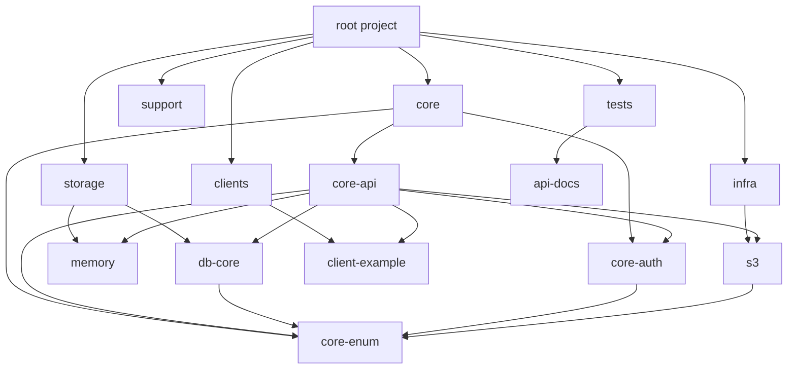

# 멀티 모듈 Gradle 프로젝트 구조 분석 및 가이드 (v2)

이 문서는 `knock-backend` 프로젝트의 멀티 모듈 구조, 각 모듈의 역할, 테스트 전략, 그리고 Gradle Kotlin DSL에 대해 상세히 설명합니다.

## 1. 프로젝트 구조 개요
현재 프로젝트는 기능과 역할에 따라 여러 개의 모듈로 나뉘어 있습니다.



### 상세 모듈 설명

| 모듈 그룹 | 모듈 이름 | 역할 및 책임 | 주요 의존성 |
| --- | --- | --- | --- |
| **core** | `core:core-api` | **웹 애플리케이션 (User Interface Layer)**<br>- HTTP 요청 처리 (Controller)<br>- 비즈니스 로직 (Service)<br>- 최종 실행 가능한 jar 생성 (`bootJar`) | `core-enum`, `core-auth`, `db-core`, `memory`, `infra:s3`, `client-example` |
| | `core:core-enum` | **공통 열거형 (Shared Enums)**<br>- 모듈 간 공유되는 Enum 클래스들<br>- 의존성 순환 방지를 위한 최하위 모듈 | (없음) |
| | `core:core-auth` | **인증/인가 (Authentication Layer)**<br>- JWT 토큰 발급 및 검증 로직<br>- Spring Security 관련 설정 | `core-enum`, `jjwt` |
| **storage** | `storage:db-core` | **RDB 데이터 접근 (Persistence Layer)**<br>- JPA Repositories, Entities<br>- DB 설정 및 스키마 관리<br>- 실행 불가능(`jar` enabled, `bootJar` disabled) | `core-enum`, `spring-boot-starter-data-jpa`, `mysql-connector` |
| | `storage:memory` | **인메모리 저장소 (Cache Layer)**<br>- Redis 설정 및 접근<br>- 임시 토큰 저장 등 | `spring-boot-starter-data-redis` |
| **infra** | `infra:s3` | **인프라스트럭처 (Infrastructure Layer)**<br>- AWS S3 파일 업로드/다운로드 로직<br>- 외부 인프라스트럭처 연동 담당 | `aws-java-sdk-s3` |
| **clients** | `clients:client-example` | **외부 연동 (External Client Layer)**<br>- 외부 API 요청 처리 (Feign Client 등)<br>- 타 서비스와의 통신 담당 | `spring-cloud-starter-openfeign` |
| **support** | `support:logging` | **로깅 지원**<br>- 로깅 설정 및 커스텀 Appender | |
| | `support:monitoring` | **모니터링**<br>- Actuator, Prometheus 등 모니터링 설정 | |
| **tests** | `tests:api-docs` | **테스트 문서화 지원**<br>- Spring REST Docs 및 RestAssured 공통 설정<br>- `testImplementation`으로 사용 | `spring-restdocs`, `rest-assured` |

## 2. 테스트 전략 및 실행 가이드

멀티 모듈 환경에서는 단위 테스트와 통합 테스트를 명확히 구분하는 것이 중요합니다.

### 테스트 종류
1.  **Unit Test (`unitTest`)**: 순수 Java/Kotlin 코드 테스트. 외부 의존성(DB, Spring Context) 없이 빠르게 실행.
2.  **Context Test (`contextTest`)**: `@SpringBootTest`를 사용하여 Spring Context를 띄우고 통합 기능을 검증. DB 연결 등을 포함.
3.  **Rest Docs Test (`restDocsTest`)**: API 문서를 생성하기 위한 테스트. `tests:api-docs` 모듈을 의존하여 공통 설정을 재사용합니다.

### IntelliJ에서 테스트 실행하기
1.  **개별 테스트**: 테스트 파일(`PostIntegrationTest.java`)에서 클래스명이나 메소드명 옆의 녹색 재생 버튼 클릭.
2.  **모듈 전체 테스트**: Gradle 탭 -> `knock-backend` -> 모듈 선택 -> `Tasks` -> `verification` -> `test` (또는 `contextTest` 등) 더블 클릭.

### Terminal에서 테스트 실행하기
```bash
# 전체 프로젝트 테스트
./gradlew test

# 특정 모듈(@core:core-api)만 테스트
# ':'는 경로 구분자입니다.
./gradlew :core:core-api:test

# 특정 모듈의 특정 태그(context) 테스트만 실행
./gradlew :core:core-api:contextTest
```

### 데모: PostIntegrationTest 구조
데모로 작성한 `PostIntegrationTest`는 `@SpringBootTest`를 사용하는 **통합 테스트**입니다.
-   **`@Tag("context")`**: 이 테스트가 context를 띄우는 무거운 테스트임을 명시합니다. Gradle 설정에서 이를 기반으로 Task를 분리할 수 있습니다.
-   **`@AutoConfigureMockMvc`**: 실제 서버를 띄우지 않고 요청을 모킹하여 컨트롤러를 테스트합니다.
-   **검증 흐름**:
    1.  `Post` 생성 요청 (POST) -> Response Body에서 ID 추출
    2.  `Post` 조회 요청 (GET) -> 생성된 ID로 조회하여 데이터가 일치하는지(`jsonPath`) 검증.
    3.  `Enum` 값(`WAITING`)이 기본값으로 잘 들어갔는지 확인.

## 3. 의존성 관리 (Dependencies) 모범 사례

`build.gradle.kts`에서 의존성을 선언할 때 `implementation`과 `api`의 차이를 이해해야 합니다.

-   **`implementation`**:
    -   내 모듈 내부에서만 사용합니다.
    -   내 모듈을 사용하는 다른 모듈에게 이 의존성을 노출하지 않습니다. (캡슐화, 빌드 속도 향상)
    -   **대부분의 경우 이것을 사용하세요.**
-   **`api`**:
    -   내 모듈을 사용하는 다른 모듈에게도 이 의존성을 전파합니다.
    -   예: `storage:db-core`가 `jpa`를 `api`로 가지면, `core:core-api`는 `db-core`만 의존해도 `jpa` 어노테이션을 쓸 수 있습니다. (하지만 결합도가 높아지므로 신중히 사용)

## 4. Gradle Kotlin DSL (`build.gradle.kts`) 속성 가이드

Gradle Kotlin DSL은 기존 Groovy DSL보다 IDE 지원(자동완성, 오류 검출)이 강력합니다. `root` 프로젝트의 `build.gradle.kts` 주요 구문을 설명합니다.

### 4.1 `plugins` 블록
```kotlin
plugins {
    id("java-library")                               // Java 라이브러리 기능 지원
    id("org.springframework.boot") apply false       // 스프링 부트 플러그인 정의만 하고 루트엔 적용 X
    id("io.spring.dependency-management")            // 스프링 의존성 버전 관리
}
```
-   `apply false`: 루트 프로젝트 자체는 스프링 부트 앱이 아니므로 플러그인 버전만 선언하고 적용하지 않습니다. 서브모듈에서 `apply(plugin = ...)`으로 가져다 씁니다.

### 4.2 `allprojects` vs `subprojects`
```kotlin
// 모든 프로젝트 (루트 + 서브모듈) 공통 설정
allprojects {
    group = "${property("projectGroup")}" // gradle.properties에서 값을 읽어옴
    repositories {
        mavenCentral() // 라이브러리 저장소
    }
}

// 서브모듈(core, storage 등)에만 적용되는 설정
subprojects {
    apply(plugin = "java-library") // 모든 서브모듈은 자바 라이브러리 성격
    
    // 서브모듈별 의존성 관리 설정
    dependencyManagement {
        imports {
            mavenBom("org.springframework.cloud:spring-cloud-dependencies:...")
        }
    }
}
```

### 4.3 Task 설정 (`tasks.getByName` vs `tasks.register`)
```kotlin
// 기존 task 설정 변경
tasks.getByName("bootJar") {
    enabled = false // 기본적으로 모든 모듈에서 실행 가능한 jar 생성을 끔 (필요한 모듈만 켬)
}

// 새로운 task 생성
tasks.register<Test>("unitTest") {
    useJUnitPlatform {
        excludeTags("context") // 'context' 태그가 붙은 테스트는 제외 (단위 테스트만 실행)
    }
}
```
-   **`register`**: Gradle 설정 단계(Configuration Phase)에서 바로 만들지 않고, 필요할 때(실행될 때) 지연 생성하여 빌드 속도를 높입니다.

### 4.4 property 사용
```kotlin
val javaVersion = property("javaVersion") as String
```
-   `gradle.properties` 파일에 정의된 변수를 가져와서 사용합니다. 버전을 한곳에서 관리하기 위함입니다.
