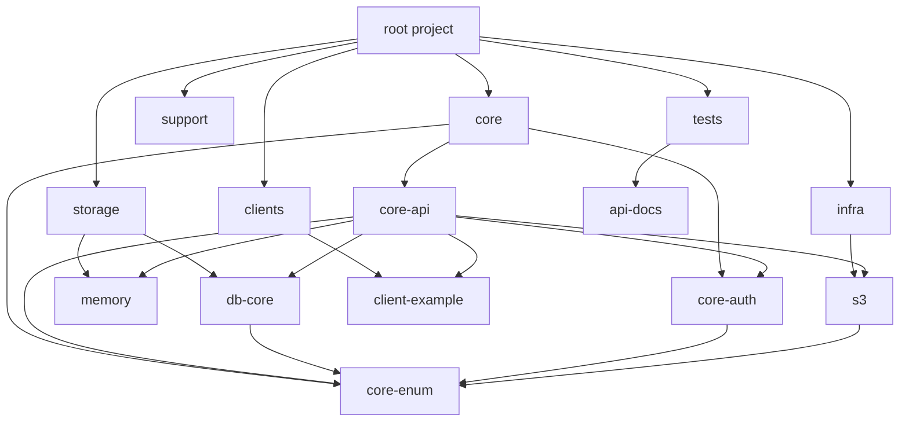

# 멀티 모듈 Gradle 프로젝트 구조 분석 및 가이드 (v3)

이 문서는 `knock-backend` 프로젝트의 멀티 모듈 구조, 각 모듈의 역할, 테스트 전략, 그리고 Gradle Kotlin DSL에 대해 설명합니다.

검수일: 2026-05-27

## 1. 프로젝트 구조 개요
현재 프로젝트는 기능과 역할에 따라 여러 개의 모듈로 나뉘어 있습니다.


```mermaid
graph TD
    Root[root project] --> Core[core]
    Root --> Storage[storage]
    Root --> Support[support]
    Root --> Clients[clients]
    Root --> Tests[tests]
    Root --> Infra[infra]

    Core --> CoreApi[core-api]
    Core --> CoreEnum[core-enum]
    Core --> CoreAuth[core-auth]

    Storage --> DbCore[db-core]
    Storage --> Memory[memory]

    Infra --> S3[s3]

    Clients --> ClientExample[client-example]

    Tests --> ApiDocs[api-docs]

    CoreApi --> DbCore
    CoreApi --> Memory
    CoreApi --> CoreEnum
    CoreApi --> CoreAuth
    CoreApi --> ClientExample
    CoreApi --> S3

    DbCore --> CoreEnum
    CoreAuth --> CoreEnum
    S3 --> CoreEnum
```

### 상세 모듈 설명

| 모듈 그룹 | 모듈 이름 | 역할 및 책임 | 주요 의존성 |
| --- | --- | --- | --- |
| **core** | `core:core-api` | **웹 애플리케이션 (User Interface Layer)**<br>- HTTP 요청 처리 (Controller)<br>- 비즈니스 로직 (Service)<br>- 최종 실행 가능한 jar 생성 (`bootJar`) | `core-enum`, `core-auth`, `db-core`, `memory`, `infra:s3`, `client-example` |
| | `core:core-enum` | **공통 열거형 (Shared Enums)**<br>- 모듈 간 공유되는 Enum 클래스들<br>- 의존성 순환 방지를 위한 최하위 모듈 | (없음) |
| | `core:core-auth` | **인증/인가 (Authentication Layer)**<br>- 세션 쿠키 기반 로그인/로그아웃 (`SessionAuthService`)<br>- Spring Security 관련 설정 | `storage:db-core`, `storage:memory`, `spring-security` |
| **storage** | `storage:db-core` | **RDB 데이터 접근 (Persistence Layer)**<br>- JPA Repositories, Entities<br>- DB 설정 및 스키마 관리<br>- 실행 불가능(`jar` enabled, `bootJar` disabled) | `core-enum`, `spring-boot-starter-data-jpa`, `mysql-connector` |
| | `storage:memory` | **인메모리 저장소 (Cache Layer)**<br>- Redis 설정 및 접근<br>- 임시 토큰 저장 등 | `spring-boot-starter-data-redis` |
| **infra** | `infra:s3` | **인프라스트럭처 (Infrastructure Layer)**<br>- AWS S3 파일 업로드/다운로드 로직<br>- 외부 인프라스트럭처 연동 담당 | `aws-java-sdk-s3` |
| **clients** | `clients:client-example` | **외부 연동 (External Client Layer)**<br>- 외부 API 요청 처리 (Feign Client 등)<br>- 타 서비스와의 통신 담당 | `spring-cloud-starter-openfeign` |
| **support** | `support:logging` | **로깅 지원**<br>- 로깅 설정 및 커스텀 Appender | |
| | `support:monitoring` | **모니터링**<br>- Actuator, Prometheus 등 모니터링 설정 | |
| **tests** | `tests:api-docs` | **테스트 문서화 지원**<br>- Spring REST Docs 및 RestAssured 공통 설정<br>- `testImplementation`으로 사용 | `spring-restdocs`, `rest-assured` |

## 2. 테스트 전략 및 실행 가이드

멀티 모듈 환경에서는 단위 테스트와 통합 테스트를 명확히 구분하는 것이 중요합니다.

### 테스트 종류
1.  **Unit Test (`unitTest`)**: `develop`, `context`, `restdocs` 태그를 제외한 기본 테스트를 실행합니다. 태그가 없는 Spring/JPA 테스트도 포함될 수 있으므로, 순수 단위 테스트만 의미하지는 않습니다.
2.  **Context Test (`contextTest`)**: `@Tag("context")`가 붙은 Spring Context 통합 테스트를 실행합니다.
3.  **Rest Docs Test (`restDocsTest`)**: API 문서를 생성하기 위한 테스트. `tests:api-docs` 모듈을 의존하여 공통 설정을 재사용합니다.
4.  **Develop Test (`developTest`)**: `@Tag("develop")`가 붙은 로컬 개발용 테스트를 실행합니다.

### IntelliJ에서 테스트 실행하기
1.  **개별 테스트**: 테스트 파일에서 클래스명이나 메소드명 옆의 녹색 재생 버튼 클릭.
2.  **모듈 전체 테스트**: Gradle 탭 -> `knock-backend` -> 모듈 선택 -> `Tasks` -> `verification` -> `test` (또는 `contextTest` 등) 더블 클릭.

### Terminal에서 테스트 실행하기
```bash
# 전체 프로젝트 테스트
./gradlew test

# 특정 모듈(core:core-api)만 테스트
# ':'는 경로 구분자입니다.
./gradlew :core:core-api:test

# 특정 모듈의 특정 태그(context) 테스트만 실행
./gradlew :core:core-api:contextTest
```

### REST Docs 테스트 구조

컨트롤러 문서화 테스트는 `tests:api-docs`의 `RestDocsTest`를 상속해 MockMvc/RestAssured 기반으로 실행합니다.

- `core-api`는 `tests:api-docs`를 `testImplementation`으로 의존합니다.
- `restDocsTest` 태스크는 `@Tag("restdocs")` 테스트를 실행합니다.
- `:core:core-api:asciidoctor`는 `restDocsTest`를 먼저 실행하고 `build/generated-snippets`를 사용합니다.

## 3. 의존성 관리 (Dependencies) 모범 사례

`build.gradle.kts`에서 의존성을 선언할 때 `implementation`과 `api`의 차이를 이해해야 합니다.

-   **`implementation`**:
    -   내 모듈 내부에서만 사용합니다.
    -   내 모듈을 사용하는 다른 모듈에게 이 의존성을 노출하지 않습니다. (캡슐화, 빌드 속도 향상)
    -   **대부분의 경우 이것을 사용하세요.**
-   **`api`**:
    -   내 모듈을 사용하는 다른 모듈에게도 이 의존성을 전파합니다.
    -   예: `storage:db-core`가 `jpa`를 `api`로 가지면, `core:core-api`는 `db-core`만 의존해도 `jpa` 어노테이션을 쓸 수 있습니다. (하지만 결합도가 높아지므로 신중히 사용)

## 4. Gradle Kotlin DSL (`build.gradle.kts`) 속성 가이드

Gradle Kotlin DSL은 기존 Groovy DSL보다 IDE 지원(자동완성, 오류 검출)이 강력합니다. `root` 프로젝트의 `build.gradle.kts` 주요 구문을 설명합니다.

### 4.1 `plugins` 블록
```kotlin
plugins {
    id("java-library")                               // Java 라이브러리 기능 지원
    id("org.springframework.boot") apply false       // 스프링 부트 플러그인 정의만 하고 루트엔 적용 X
    id("io.spring.dependency-management")            // 스프링 의존성 버전 관리
    id("io.spring.javaformat") apply false           // Java format 플러그인
    id("org.asciidoctor.jvm.convert") apply false    // REST Docs HTML 생성
    id("org.sonarqube") version "7.1.0.6387"         // SonarQube 분석
}
```
-   `apply false`: 루트 프로젝트 자체는 스프링 부트 앱이 아니므로 플러그인 버전만 선언하고 적용하지 않습니다. 서브모듈에서 `apply(plugin = ...)`으로 가져다 씁니다.

### 4.2 `allprojects` vs `subprojects`
```kotlin
// 모든 프로젝트 (루트 + 서브모듈) 공통 설정
allprojects {
    group = "${property("projectGroup")}" // gradle.properties에서 값을 읽어옴
    repositories {
        mavenCentral() // 라이브러리 저장소
    }
}

// 서브모듈(core, storage 등)에만 적용되는 설정
subprojects {
    apply(plugin = "java-library") // 모든 서브모듈은 자바 라이브러리 성격
    apply(plugin = "jacoco")       // 테스트 커버리지 리포트
    
    // 서브모듈별 의존성 관리 설정
    dependencyManagement {
        imports {
            mavenBom("org.springframework.cloud:spring-cloud-dependencies:...")
        }
    }
}
```

### 4.3 Task 설정 (`tasks.getByName` vs `tasks.register`)
```kotlin
// 기존 task 설정 변경
tasks.named("bootJar") {
    enabled = false // 기본적으로 모든 모듈에서 실행 가능한 jar 생성을 끔 (필요한 모듈만 켬)
}

// 새로운 task 생성
tasks.register<Test>("unitTest") {
    useJUnitPlatform {
        excludeTags("develop", "context", "restdocs")
    }
}
```
-   **`register`**: Gradle 설정 단계(Configuration Phase)에서 바로 만들지 않고, 필요할 때(실행될 때) 지연 생성하여 빌드 속도를 높입니다.

### 4.4 property 사용
```kotlin
val javaVersion = property("javaVersion") as String
```
-   `gradle.properties` 파일에 정의된 변수를 가져와서 사용합니다. 버전을 한곳에서 관리하기 위함입니다.

## 5. 최근 반영사항 (2026-05-26)

아래 변경은 모듈 간 책임 분리를 유지한 채 각 레이어에 반영되었습니다.

- `core:core-api` + `storage:db-core`
  - 상품에 거래 위치 필드(`tradeLocationName`, `tradeLocationAddress`, `tradeLatitude`, `tradeLongitude`) 추가
  - 전체 마켓 상품 목록 API 추가: `GET /api/v1/items`
  - 공개 판매자 상품 목록 API 추가: `GET /api/v1/members/{memberId}/items`
  - 만료 가능한 판매자 공유 링크 추가: `POST /api/v1/seller-shares`, `GET /api/v1/seller-shares/{token}`
  - 공유 링크 관리 API 추가: `GET /api/v1/seller-shares/my`, `DELETE /api/v1/seller-shares/{token}`
  - 공유 링크는 현재 링크 1개 기준으로 관리하며, 새 링크 생성 시 기존 링크를 비활성화
  - 현재 공유 링크 지표(`clickCount`, `useCount`)와 중단 상태(`active`) 저장
  - 상품 외부 URL용 `publicId` 추가. 내부 PK는 유지하되 홈/공유 매대/북마크 링크는 `/item/{publicId}`를 사용
  - 상품 등록은 인증된 판매자의 개인 매대에 저장되며 `groupId`와 `category`를 받지 않음
  - 그룹 장터 스키마(`Group`, `GroupMember`, `item.group_id`) 제거
  - 차단 스키마/API(`MemberBlock`, `/members/{memberId}/block`) 제거
  - 매너온도/평판 계산 스키마와 서비스 제거
  - 거래 위치 좌표 범위 검증 추가
  - 상품 삭제 시 활성 예약(`WAITING`, `APPROVED`) 자동 취소 후 소프트 삭제
  - 예약 승인 시 `FOR UPDATE` 조회 대상 누락을 예외 처리(`RESERVATION_NOT_FOUND`)
  - 알림 전체 읽음 API 추가: `PATCH /api/v1/notifications/read-all`
  - 후기 작성/조회 API 유지: `POST /api/v1/reviews`, `GET /api/v1/members/{memberId}/reviews`
- `core:core-api` (DTO)
  - 상품 상세/목록 응답에 `publicId`, 판매자 닉네임/프로필 이미지, 거래 위치 필드 확장
  - 북마크 응답에 `itemPublicId`, `type`, `status`, `itemCreatedAt` 확장
- 루트 하네스
  - `Makefile`, `scripts/harness.sh`, `harness/harness.yml` 추가
  - 루트에서 `make doctor`, `make verify`, `make backend-run`, `make frontend-test` 실행 가능
- `knock-frontend`
  - 개인 판매 페이지(`/seller/:memberId`, `/shop/:token`) 추가
  - 개인 판매 페이지에 구글 드라이브 일반 액세스와 유사한 단일 공유 링크 모달 추가
  - 홈과 하단 탭에서 그룹 중심 문구 제거
  - 상품 등록 화면에서 그룹/카테고리 선택 제거
  - 상품 등록 화면에 Naver Map 검색/지도 선택 기반 거래 위치 입력 추가
  - 상품 상세 화면에 Naver Map 표시 및 검색 링크 fallback 추가
  - 로그아웃 버튼이 서버 `POST /api/v1/auth/logout` 호출 후 이동하도록 수정
  - 상품 상세는 UUID 형식 `publicId` 라우트만 공개 접근으로 허용하고, 관리 화면은 숫자 내부 ID를 인증 후 사용
  - 생성/상세 화면의 잘못된 UI 상태(무한 로딩, 비작동 토글, 잘못된 라벨/북마크 상태) 보정
