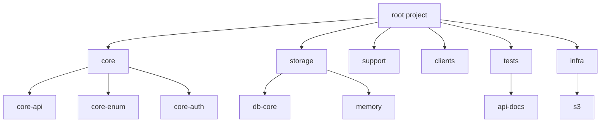

# Knock Technical Reference

업데이트 기준: 2026-06-18
상태: technical/API/module reference source of truth

이 문서는 Knock의 API 요약, 백엔드 모듈 구조, 레이어/DTO/테스트 기준을 모은 기술 참조다. 제품 요구사항은 `docs/SPEC.md`, 개발 관행은 `docs/PRACTICES.md`, 운영 절차는 `docs/RUNBOOK.md`를 따른다.

## 1. API 기준

문서화된 API는 `core-api` 모듈의 Controller와 DTO를 기준으로 검수한다. 상세 Request/Response 스니펫은 다음 명령으로 생성되는 REST Docs HTML을 기준으로 확인한다.

```bash
cd knock-backend
./gradlew :core:core-api:asciidoctor
```

REST Docs 원본: `knock-backend/core/core-api/src/docs/asciidoc/index.adoc`

인증 방식은 세션 쿠키 기반이다. Google OAuth 로그인은 구현되어 있고 Kakao 소셜 로그인은 아직 구현되지 않았다.

### Auth API

| Method | URI | 설명 | 상태 |
|---|---|---|---|
| POST | `/api/v1/auth/login` | 이메일 로그인 | ✅ |
| POST | `/api/v1/auth/logout` | 로그아웃 | ✅ |
| GET | `/api/v1/auth/social/google/start` | Google OAuth 시작, 내부 `next`를 세션에 저장 | ✅ |
| GET | `/api/v1/auth/social/google/callback` | Google OAuth 콜백 로그인 | ✅ |
| POST | `/api/v1/auth/social/kakao` | Kakao 소셜 로그인 | ❌ |

Google OAuth의 `next`는 `/start` 요청에서 받은 값을 세션에 저장하고 콜백에서 소비한다. 허용되는 `next`는 `/`로 시작하는 내부 경로이며 `//`, CR, LF 문자를 포함하면 기본 성공 리다이렉트 경로로 대체한다.

이메일 로그인 request body는 유효한 형식의 `email`과 공백이 아닌 `password`가 필수다. 누락, 공백, 잘못된 이메일 형식은 HTTP 경계에서 400 `VALIDATION_ERROR`로 차단한다.

### Member / Seller Share API

| Method | URI | 설명 | 상태 |
|---|---|---|---|
| POST | `/api/v1/members` | 회원가입 | ✅ |
| GET | `/api/v1/members/my` | 내 정보 조회 | ✅ |
| PUT | `/api/v1/members/my` | 내 정보 수정 | ✅ |
| GET | `/api/v1/members/my/settings/notifications` | 알림 설정 조회 | ✅ |
| PUT | `/api/v1/members/my/settings/notifications` | 알림 설정 수정 | ✅ |
| GET | `/api/v1/members/{memberId}/items` | 특정 회원의 공개 판매 상품 목록 | ✅ |
| POST | `/api/v1/seller-shares` | 내 판매 페이지 공유 링크 생성 | ✅ |
| GET | `/api/v1/seller-shares/my` | 내 현재 공유 링크와 지표 조회 | ✅ |
| DELETE | `/api/v1/seller-shares/{token}` | 공유 링크 중단 | ✅ |
| GET | `/api/v1/seller-shares/{token}` | 공유 링크로 판매 페이지 조회 | ✅ |

공유 링크 유효시간은 `ONE_HOUR`, `ONE_DAY`, `PERMANENT`만 사용한다. 새 공유 링크를 만들면 기존 링크는 비활성화되고, 조회 API는 최신 링크 0~1개를 반환한다.

### Item API

| Method | URI | 설명 | 상태 |
|---|---|---|---|
| GET | `/api/v1/items` | 전체 마켓 상품 목록, 비로그인 가능 | ✅ |
| POST | `/api/v1/items` | 내 개인 매대에 상품 등록 | ✅ |
| GET | `/api/v1/items/{itemPublicId}` | UUID 공개 식별자 기반 상품 상세, 비로그인 가능 | ✅ |
| GET | `/api/v1/items/manage/{itemId}` | 판매자 관리 화면용 상품 상세 | ✅ |
| GET | `/api/v1/items/my-selling` | 내 판매 상품 목록 | ✅ |
| DELETE | `/api/v1/items/{itemId}` | 내 상품 삭제, 활성 예약 자동 취소 | ✅ |
| POST | `/api/v1/item-policy/warnings` | 상품 등록 전 금지 품목 warning preflight | P0 |

상품 등록에는 `title`, `description`, `price`, `itemType`, `imageUrls`, `tradeLocationName`, `tradeLocationAddress`, `tradeLatitude`, `tradeLongitude`가 필요하다. 위도 범위는 `-90..90`, 경도 범위는 `-180..180`이다. 상품 상세 URL은 `/item/{publicId}`를 사용한다. 금지 품목 안내는 item create 응답을 변경하지 않고 `POST /api/v1/item-policy/warnings` preflight로 처리한다.

조회수는 Redis TTL 키로 30분 내 중복 조회를 방지한 뒤 증가한다. 판매자 본인 조회는 집계하지 않고, Redis 오류가 발생해도 상세 조회 응답은 유지한다.

`POST /api/v1/item-policy/warnings` request body는 `title`, `description`, 선택 `itemType`을 받는다. response body는 `policyVersion`, `warningCategories[]`, `policyUrl`, `severity`, `message`를 반환한다. MVP `severity` 값은 `NONE` 또는 `WARNING`만 허용한다. `BLOCKING`은 법무/운영 ADR 전까지 사용하지 않는다. 서버 warning API가 정책 source of truth이며, preflight 실패 시 클라이언트는 hard block하지 않고 안전 안내 fallback 후 기존 `POST /api/v1/items`를 호출할 수 있어야 한다.

### Reservation / Bookmark / Notification / Review API

| 영역 | 주요 URI | 설명 | 상태 |
|---|---|---|---|
| Bookmark | `POST /api/v1/items/{itemId}/bookmarks` | 찜 토글 | ✅ |
| Bookmark | `GET /api/v1/items/my-bookmarks` | 내 찜 목록 | ✅ |
| Reservation | `POST /api/v1/reservations` | 예약 신청 | ✅ |
| Reservation | `PATCH /api/v1/reservations/{id}/approve` | 예약 승인 | ✅ |
| Reservation | `PATCH /api/v1/reservations/{id}/complete` | 거래 완료 | ✅ |
| Reservation | `PATCH /api/v1/reservations/{id}/cancel` | 예약 취소 | ✅ |
| Reservation | `GET /api/v1/items/{itemId}/reservations` | 상품별 예약 목록 | ✅ |
| Reservation | `GET /api/v1/reservations/my` | 내 예약 내역 | ✅ |
| Report | `POST /api/v1/reports` | 상품/회원/예약/후기 신고 접수 | ✅ |
| Notification | `GET /api/v1/notifications` | 알림 목록 | ✅ |
| Notification | `PATCH /api/v1/notifications/{id}/read` | 알림 읽음 처리 | ✅ |
| Notification | `PATCH /api/v1/notifications/read-all` | 전체 읽음 처리 | ✅ |
| Review | `POST /api/v1/reviews` | 거래 후기 작성 | ✅ |
| Review | `GET /api/v1/members/{memberId}/reviews` | 특정 회원 후기 목록 | ✅ |

예약 신청 request body는 양수 `itemId`가 필수다. `itemId` 누락, `null`, `0`, 음수 값은 HTTP 경계에서 400 `VALIDATION_ERROR`로 차단한다.

신고 생성 request body는 `targetType`(`MEMBER`, `ITEM`, `RESERVATION`, `REVIEW`), 양수 `targetId`, `reason`(`PROHIBITED_ITEM`, `SUSPECTED_FRAUD`, `OFF_PLATFORM_PAYMENT`, `PERSONAL_INFO_OR_CODE_REQUEST`, `HARASSMENT_OR_THREAT`, `NO_SHOW`, `COUNTERFEIT_OR_STOLEN_SUSPECTED`, `OTHER`)이 필수다. 중복 기준은 `(reporterId, targetType, targetId, reason)`이며 자기 자신 또는 본인 상품/후기 신고는 차단한다.

### Image / Location API

| Method | URI | 설명 | 상태 |
|---|---|---|---|
| POST | `/api/v1/images/upload` | 이미지 업로드 | ✅ |
| DELETE | `/api/v1/images` | 이미지 삭제 | ✅ |
| GET | `/api/v1/locations/search?query={query}` | Naver Local Search/Geocoding 기반 픽업 위치 검색 | ✅ |

이미지 삭제의 `imageUrl`은 파싱 가능한 URL이어야 하며 비어 있지 않은 object path를 포함해야 한다. `null`, 공백, 잘못된 URL, path 없는 URL은 S3 삭제 호출 전에 400 `VALIDATION_ERROR`로 차단한다.

Location search는 백엔드 `NAVER_MAP_CLIENT_ID`, `NAVER_MAP_CLIENT_SECRET`, `NAVER_SEARCH_CLIENT_ID`, `NAVER_SEARCH_CLIENT_SECRET`가 필요하다. `NAVER_MAP_CLIENT_SECRET`는 프론트엔드에 넣지 않는다.

## 2. 백엔드 모듈 구조



| 모듈 | 책임 | 주요 의존성 |
|---|---|---|
| `core:core-api` | HTTP Controller, Service, 실행 jar | `core-enum`, `core-auth`, `db-core`, `memory`, `infra:s3` |
| `core:core-enum` | 공통 Enum, 순환 의존 방지 | 없음 |
| `core:core-auth` | 세션 쿠키 기반 인증/인가 | `db-core`, `memory`, Spring Security |
| `storage:db-core` | JPA Entity/Repository, DB 설정 | `core-enum`, JPA, MySQL/H2 |
| `storage:memory` | Redis 설정과 접근 | Spring Data Redis |
| `infra:s3` | S3 파일 업로드/다운로드 | AWS SDK S3 |
| `clients:client-example` | 외부 API 요청 처리 | OpenFeign |
| `tests:api-docs` | REST Docs / RestAssured 공통 테스트 지원 | Spring REST Docs |

모듈 의존은 단방향으로 유지한다. API 진입점은 `core:core-api`, 인증은 `core:core-auth`, 영속성은 `storage:db-core`, 인프라는 `infra:s3`가 담당한다.

## 3. 레이어와 DTO 기준

기본 흐름은 `Controller -> Service -> Repository`이다.

- Controller는 HTTP 입출력, request validation, 인증 주체 추출, DTO 변환만 담당한다.
- Service는 유스케이스 단위 비즈니스 로직과 트랜잭션 경계를 담당한다.
- Repository는 인터페이스를 통해 접근하고, 복잡 조회/락/네이티브 쿼리는 persistence 경계에 캡슐화한다.
- Entity는 DB 매핑과 최소 도메인 상태 변경 로직을 포함한다.

DTO 흐름:

```text
RequestDto -> Data/Command -> Service -> Result -> ResponseDto -> ApiResponse<T>
```

- Request DTO: HTTP 입력 형식 검증과 정규화
- Domain input: `*Data` 또는 `*Command`
- Domain output: `*Result`
- Response DTO: entity를 직접 노출하지 않는 API 응답

v1 JSON API 성공 응답은 `ApiResponse<T>`를 기본으로 한다. `/health` 상태 점검과 OAuth 302 redirect 엔드포인트는 `ResponseEntity` 예외를 허용한다.

## 4. 트랜잭션, 동시성, 보안 기준

- 조회는 `@Transactional(readOnly = true)`, 변경은 `@Transactional`을 명시한다.
- 예약 등 경쟁 조건이 있는 유스케이스는 DB 락/원자 연산/유니크 제약/멱등 처리 중 하나를 선택하고 테스트한다.
- 예약 승인처럼 잠금 대상에서 누락된 엔티티는 즉시 예외로 처리한다.
- 소프트 삭제와 연계된 도메인 상태 전이는 삭제 전에 명시적으로 처리한다.
- 공개 조회 API를 추가할 때는 SecurityConfig permit rule과 개인정보 노출 필드를 함께 검토한다.
- Trust & Safety API는 공개 조회와 인증 상호작용을 분리한다. 차단 상태와 신고 정보는 공개 응답 필드에 포함하지 않고, block check는 reservation/bookmark/review/notification 같은 서비스 유스케이스 경계에서 적용한다.
- 비밀번호, 비밀키, 토큰, 외부 API credential은 로그와 응답에 노출하지 않는다.

## 5. 테스트와 Gradle 기준

테스트 태그:

- `unitTest`: `develop`, `context`, `restdocs` 제외
- `contextTest`: `@Tag("context")`
- `restDocsTest`: `@Tag("restdocs")`
- `developTest`: `@Tag("develop")`

주요 명령:

```bash
cd knock-backend
./gradlew test
./gradlew :core:core-api:test
./gradlew :core:core-api:contextTest
./gradlew :core:core-api:restDocsTest
./gradlew :core:core-api:asciidoctor
```

Gradle Kotlin DSL 기준:

- 대부분의 의존성은 `implementation`을 사용해 캡슐화를 유지한다.
- 다른 모듈 사용자에게 노출해야 하는 의존성만 `api`를 사용한다.
- `tasks.register`로 새 task를 지연 생성하고, 기존 task 변경은 `tasks.named`를 사용한다.
- 버전과 공통 값은 `gradle.properties`에서 가져온다.

## 6. 최근 반영된 기술 맥락

- 상품에 거래 위치 필드와 `publicId`가 추가됐다.
- 전체 마켓, 판매자 상품 목록, 공유 링크 API가 추가됐다.
- 상품 등록은 인증된 판매자의 개인 매대에 저장되며 `groupId`와 `category`를 받지 않는다.
- 그룹 장터, 차단, 매너온도/평판 계산 스키마와 서비스는 주요 코드 경로에서 제거됐다.
- 예약 승인 시 `FOR UPDATE` 조회 대상 누락을 예외 처리한다.
- Trust & Safety P0는 report duplicate policy, block idempotency/self-block rejection, item-policy warning severity(`NONE`/`WARNING`), block matrix 상호작용 차단을 REST Docs와 테스트로 고정한다.
- 상품 삭제 시 활성 예약을 자동 취소한 뒤 소프트 삭제한다.
- 프론트는 `/seller/:memberId`, `/shop/:token`, Naver Map 기반 거래 위치 입력, UUID `publicId` 공개 상세를 지원한다.

## 7. 기술 리스크와 후속 확인

- API DTO 변경 시 backend DTO, frontend `types.ts`, service wrapper, 이 문서, REST Docs를 같은 변경에서 갱신한다.
- Naver와 S3는 런타임 의존성이다. 누락/오류 config는 비밀값 없이 안전하게 실패해야 한다.
- 공개/인증 라우트 정책 변경 후 Hash-router path와 login `next` QA를 수행한다.
- manual API reference와 generated REST Docs가 drift되지 않도록 API 변경 시 Asciidoctor를 재실행한다.
